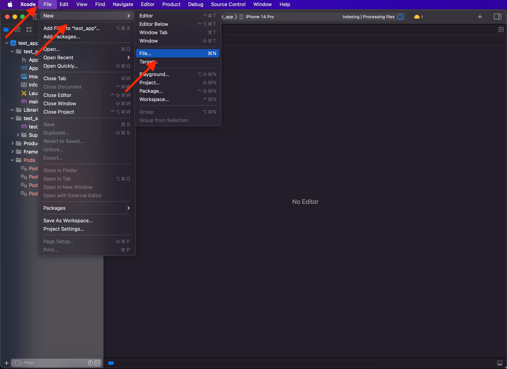
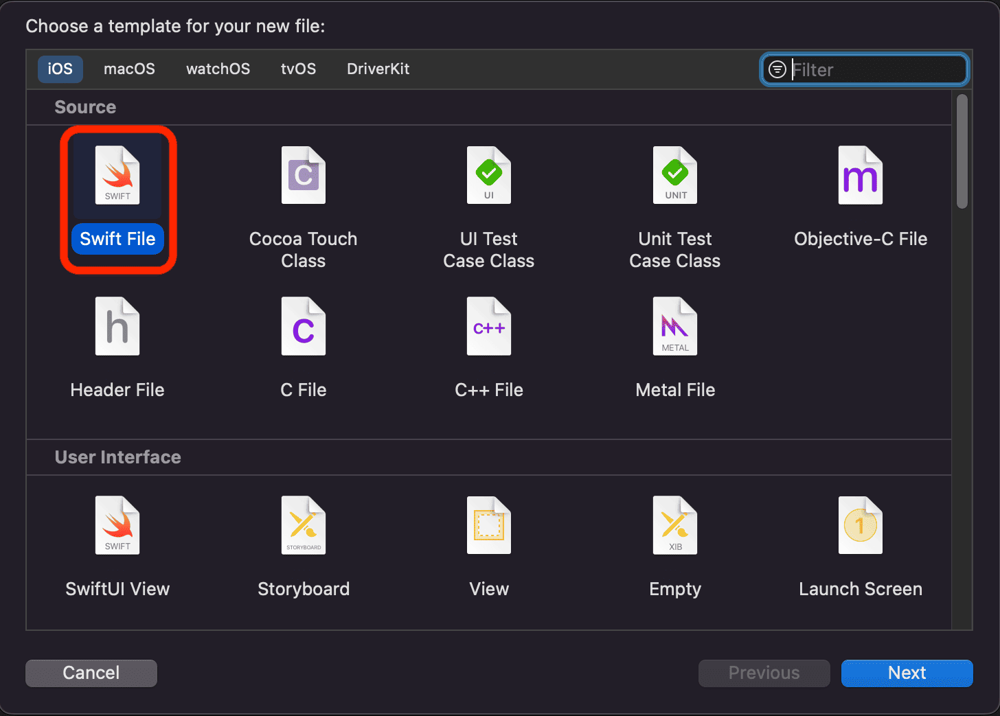
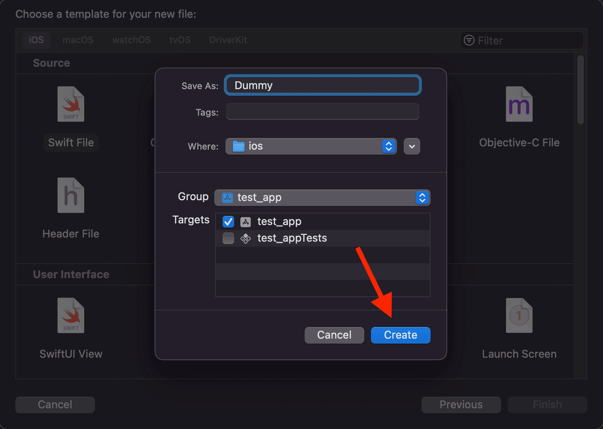
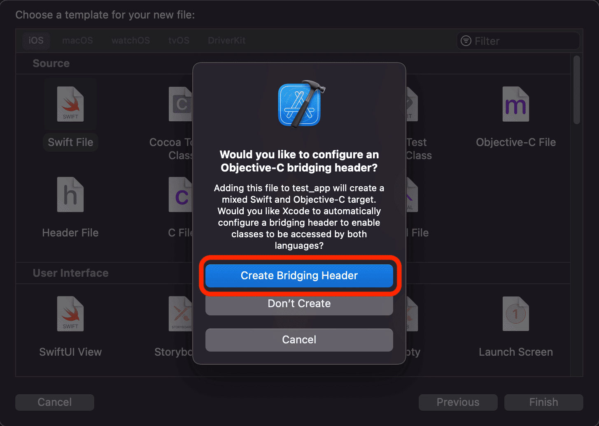
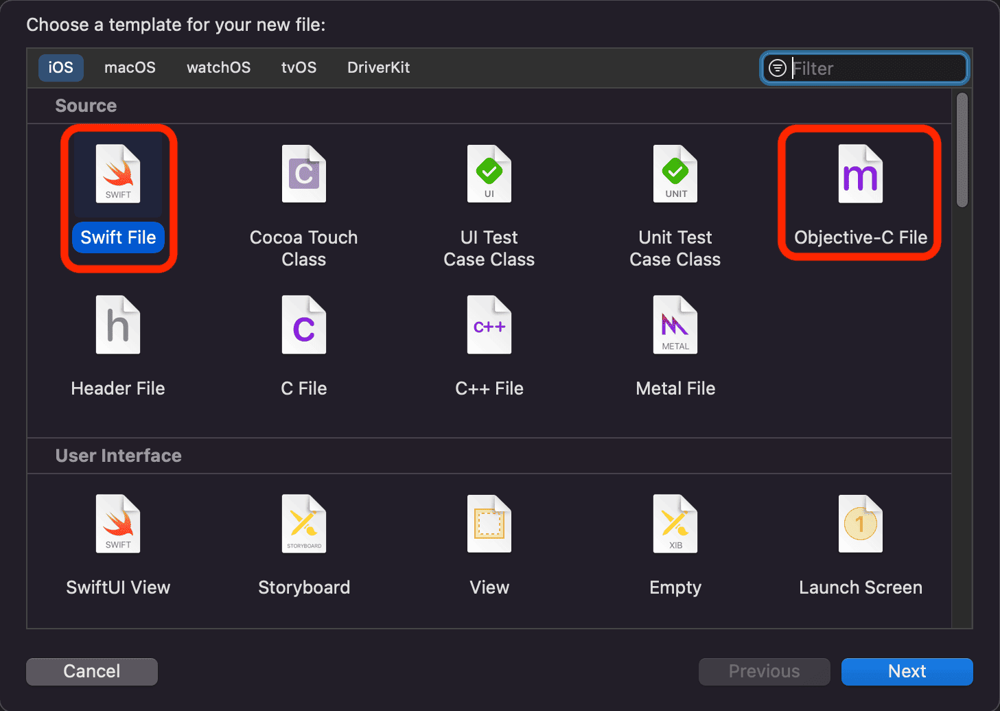

# iOS Video and Photo Editor SDK quick start

This guide demonstrates how to quickly integrate iOS Video Editor SDK into React Native project.
The main part of an integration and customization is implemented in ```ios``` directory
of React Native project using native iOS development process.

Once complete you will be able to launch video editor in your React Native project.

- [Installation](#installation)
- [Resources](#resources)
- [Configuration](#configuration)
- [Launch](#launch)
- [Face AR Effects](#face-ar-effects)
- [Connect External Audio API](#connect-external-audio-api)


## Installation
Add iOS Video Editor SDK dependencies to your [Podfile](../ios/Podfile).

## Resources
**Video Editor SDK** uses a lot of resources required for running.  
Please make sure all these resources are provided in your project.
1. [luts](../ios/vesdkreactnativecliintegrationsample/luts) to use Lut effects shown in the Effects tab.
2. [Localizable.strings](../ios/Localizable.strings) file with English localization.

**Video Editor SDK** needs only the [Localizable.strings](../ios/Localizable.strings) file.

## Configuration

> [!IMPORTANT]  
> Check if the file [YourProject-Bridging-Header.h](../ios/BridgeHeader.h) exists in your React Native project in the ```ios``` folder.

Add [VE-Sample-Bridging-Header.h](../ios/BridgeHeader.h) and [SdkEditorModuleBridge.m](../ios/SdkEditorModuleBridge.m) files for communication between React Native and iOS
and [SdkEditorModule.swift](../ios/SdkEditorModule.swift) file to initialize the SDK dependencies. This class also allows you to customize many Video and Photo Editor SDK features i.e.
min/max video durations, export flow, order of effects and others.

### Add YourProject-Bridging-Header.h file

#### Create a new Bridging-Header.h file

To create [YourProject-Bridging-Header.h](../ios/BridgeHeader.h), open your iOS project in Xcode and follow the steps below:

1) Create a new empty Swift file in your project by following the path ```File -> New -> File```:<br>
2) Choose ```Swift file``` and click ```Next```:<br>
3) Click ``Create``:<br>
4) Xcode will suggest you to configure an Objective-C bridging Header. Click ```Create Bridging Header```:<br>
5) Copy [VE-Sample-Bridging-Header.h](../ios/BridgeHeader.h) to your ```YourProject-Bridging-Header.h```.

#### Add to existing YourProject-Bridging-Header.h

1) Copy [VE-Sample-Bridging-Header.h](../ios/BridgeHeader.h) to your ```YourProject-Bridging-Header.h```.

### Add SdkEditorModule.swift file

1) Create a new Swift file in your project by following the path ```File -> New -> File```:<br>
2) Choose ```Swift file``` and click ```Next```:<br>
3) Set the name ```SdkEditorModule``` and click ``Create``:<br>
4) Copy [SdkEditorModule.swift](../ios/SdkEditorModule.swift) to your ```SdkEditorModule```.

### Add SdkEditorModuleBridge.m file

#### Create a new SdkEditorModuleBridge.m file

1) Create a new empty .m file in your project by following the path ```File -> New -> File```:<br>
2) Choose ```Objective-C file``` and click ```Next```:<br>
3) Set the name of the file and click ```Next```:<br><br>On the next view click ```Create```.
4) Copy [SdkEditorModuleBridge.m](../ios/SdkEditorModuleBridge.m) to your ```SdkEditorModuleBridge.m```.

#### Add to existing SdkEditorModuleBridge.m file

1) Copy [SdkEditorModuleBridge.m](../ios/SdkEditorModuleBridge.m) to your ```SdkEditorModuleBridge.m```

## Launch

Invoke [initSDK](../App.js#L16) on React Native side to initialize Video Editor SDK with the license token.
```javascript
SdkEditorModule.initSDK(LICENSE_TOKEN);
```

Add [ReactMethod](../ios/SdkEditorModule.swift#L35) on iOS side to initialize Video Editor SDK.

Please note that the instance  ```videoEditor``` can be **nil** if the license token is incorrect.  
[See example](../ios/SdkEditorModule.swift#L46)

Finally, once the SDK in initialized you can invoke [openVideoEditor](../App.js#L24) message from React Native to iOS

```javascript
await SdkEditorModule.openVideoEditor();
```

and add [ReactMethod](../ios/SdkEditorModule.swift#L56) on iOS side to start Video Editor.

### Export media
Video Editor SDK exports single video with auto quality by default. Auto quality is based on device hardware capabilities.

Process the result and pass it to [handler](../App.js#L56) on React Native side.

## Face AR Effects

[Banuba Face AR SDK product](https://www.banuba.com/facear-sdk/face-filters) is used on camera and editor screens for applying various AR effects while making video content.
Any Face AR effect is a folder that includes a number of files required for Face AR SDK to play this effect.

> [!INFO]
> Make sure preview.png file is included in effect folder. You can use this file as a preview for AR effect.

There are 2 options for adding and managing AR effects:

1. [bundleEffects](../ios/vesdkreactnativecliintegrationsample/bundleEffects/) folder - use bundleEffects folder
2. Use [AR Cloud](https://www.banuba.com/faq/what-is-ar-cloud) for storing effects on a server.

## Connect audio

This is an optional section in the integration process. In this section you will know how to connect audio to Video Editor.

### Connect Soundstripe
Set ```false``` to [configEnableCustomAudioBrowser](../ios/AppDelegate.swift#L16)
and specify ```Soundstripe``` in your [SdkEditorModule](../ios/SdkEditorModule.swift#L340)

> [!IMPORTANT]
> The feature is not activated by default. Please, contact Banuba representatives to know more about using this feature.

```swift
AudioBrowserConfig.shared.musicSource = .soundstripe
```

to use audio from [Soundstripe](https://www.soundstripe.com/) in Video Editor.

### Connect Mubert

Request API key from [Mubert](https://mubert.com/).  

> [!IMPORTANT]
> Banuba is not responsible for providing Mubert API key.

Set ```false``` to [configEnableCustomAudioBrowser](../ios/AppDelegate.swift#L16)
and specify ```MubertApiConfig``` in your [SdkEditorModule](../ios/SdkEditorModule.swift#L340)

```swift
AudioBrowserConfig.shared.musicSource = .mubert
BanubaAudioBrowser.setMubertKeys(
  license: "SET MUBERT API LICENSE",
  token: "SET MUBERT API TOKEN"
)
```

to use audio from [Mubert](https://mubert.com/) in Video Editor.

### Connect Banuba Music

Set ```false``` to [configEnableCustomAudioBrowser](../ios/AppDelegate.swift#L16)
and specify ```BanubaMusicProvider``` in your [SdkEditorModule](../ios/SdkEditorModule.swift#L340)

> [!IMPORTANT]
> The feature is not activated by default. Please, contact Banuba representatives to know more about using this feature.

```swift
AudioBrowserConfig.shared.musicSource = .banubaMusic
```

to use audio from ```Banuba Music``` in Video Editor.

## Connect External Audio API
Video Editor SDK allows to implement your experience of providing audio tracks for your users - custom Audio Browser.  
To check out the simplest experience you can set ```true``` to [configEnableCustomAudioBrowser](../ios/AppDelegate.swift#L16)  

> [!IMPORTANT]
> Video Editor SDK can play only files stored on device.
